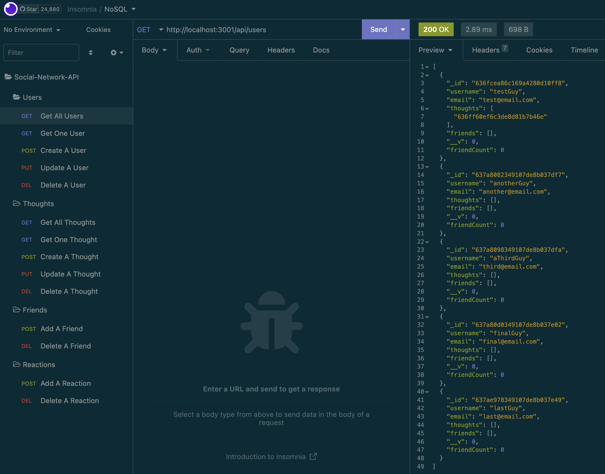

# Social-Network-API

### [Project URL](https://github.com/jWeibelbootcamp/Social-Network-API) 

## Table of Contents
- [Project Description](#description)
- [Installation Instructions](#installation)
- [Usage Instructions](#usage)
- [Contributing Resources](#contribution)
- [Testing Methods](#test)
- [GitHub User Name](#gitHub)
- [Email Address](#email)

## Project Description
API for a social network web application where users can share their thoughts, react to friends’ thoughts, and create a friend list. 

## Installation Instructions
Install Node.js, MongoDB, and npms: express, dotenv, and mongoose.

## Usage Instructions
node server.js in terminal. 

## Contributing Resources
Node.js, MongoDB, Express, and Mongoose. 

## Testing Methods
VS Code and Insomnia.

## GitHub User Name
jWeibelbootcamp

## Email Address
weibel.jason@gmail.com

## Licensing 
Apache 2.0